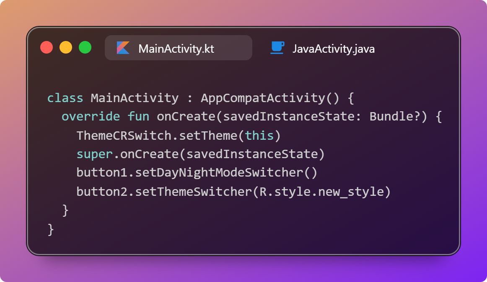
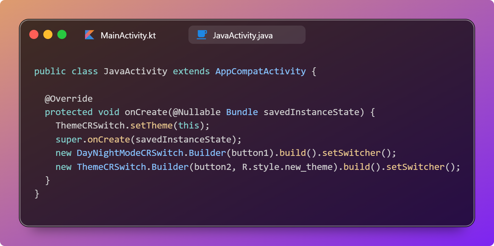
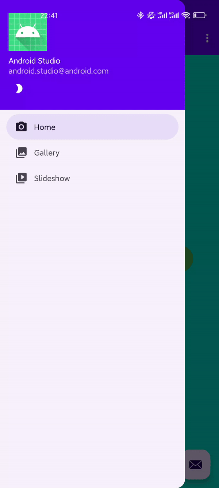
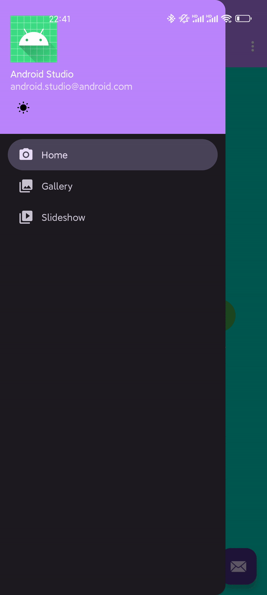
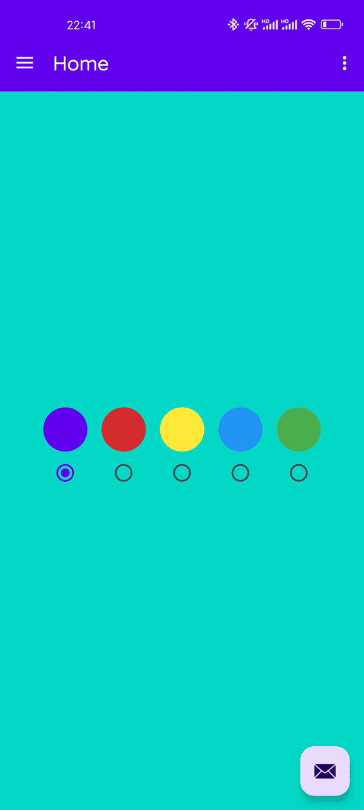
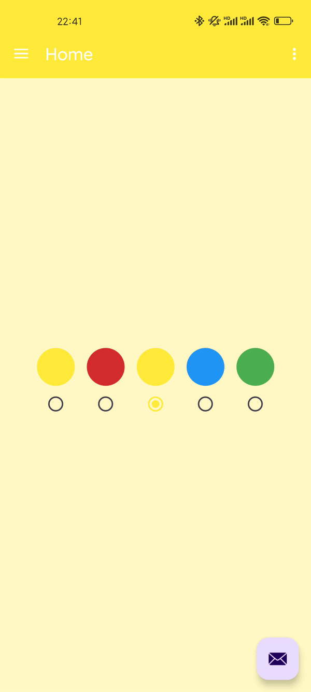

<h1 align="center">CircularRevealSwitch</h1>
<h2 align="center">环形揭示切换</h2>

<p align="center">
    <br>
    <strong>只需至少一句代码实现 Telegram 环形揭示切换主题动画</strong>
    <br>
    <br>
    
    <br>
    <br>
    
</p>

<p align="center">
    
    
    
</p>

## 使用

在 settings.gradle.kts 中添加 jitpack 仓库

```kotlin
dependencyResolutionManagement {
    repositoriesMode.set(RepositoriesMode.FAIL_ON_PROJECT_REPOS)
    repositories {
        google()
        mavenCentral()
        maven {
            url = uri("https://jitpack.io")
            // groovy:
            // url 'https://jitpack.io'
        }
    }
}
```

在你的模块下的 build.gradle.kts 中添加依赖

```kotlin
dependencies {
    implementation("com.github.YenalyLiew:CircularRevealSwitch:0.1")
}
```

## 使用效果

| 日间到夜间                                       | 夜间到日间                                     | 切换至黄色主题                                     | 切换至红色主题                                  |
| ------------------------------------------------ | ---------------------------------------------- | -------------------------------------------------- | ----------------------------------------------- |
|  |  |  |  |

## 使用要求

Android API 至少为 21 （Android 5.0）

## 优势

- [x] **无需自行嵌套、添加新 View**
- [x] 使用合理不会造成内存泄漏
- [x] 有一定拓展性，方法均为 `protected open`
- [x] 实现最简单的日夜间切换动画只需要**一行代码**

## 基础使用方法

### 日夜间切换

#### Kotlin

```kotlin
view.setDayNightModeSwitcher(
    duration = 400L,
    interpolator = FastOutSlowInInterpolator(),
    animToDayMode = SwitchAnimation.SHRINK, // 前往日间模式的动画
    animToNightMode = SwitchAnimation.EXPAND, // 前往夜间模式的动画
    onNightModeAnimStart = { TODO("切换夜间模式动画开始回调") },
    onNightModeAnimEnd = { TODO("切换夜间模式动画结束回调") },
    onDayModeAnimStart = { TODO("切换日间模式动画开始回调") },
    onDayModeAnimEnd = { TODO("切换日间模式动画结束回调") },
    onClick = { TODO("点击事件") },
)
```

#### Java

```java
DayNightModeCRSwitch builder = new DayNightModeCRSwitch.Builder(view)
        .duration(400L)
        .interpolator(new FastOutSlowInInterpolator())
        .animToDayMode(SwitchAnimation.SHRINK) // 前往日间模式的动画
        .animToNightMode(SwitchAnimation.EXPAND) // 前往夜间模式的动画
        .onNightModeAnimStart(() -> {
            // TODO: 切换夜间模式动画开始回调
        })
        .onNightModeAnimEnd(() -> {
            // TODO: 切换夜间模式动画结束回调
        })
        .onDayModeAnimStart(() -> {
            // TODO: 切换日间模式动画开始回调 
        })
        .onDayModeAnimEnd(() -> {
            // TODO: 切换日间模式动画结束回调
        })
        .onClickListener((view) -> {
            // TODO: 点击事件
        })
        .build();
builder.setSwitcher();
```

### 主题切换

> ⚠ 你需要在 `super.onCreate(savedInstanceState)` 之前调用 `setTheme` 方法，加载你切换的主题。如果你只想要个动画，可以选择直接调用 `ThemeCRSwitch.setTheme(int)`
>
> ⚠ `ThemeCRSwitch.setTheme(int)` 只是自慰方法，不推荐使用。如果需要保存主题状态，请自行使用 SharedPreferences 或其他库进行储存与加载
>
> 🌰 举例：
>
> ```kotlin
> override fun onCreate(savedInstanceState: Bundle?) {
>     when (sharedPrefs().getString("theme", "default")) {
>         "red" -> setTheme(R.style.Theme_CircularRevealSwitch_Red)
>         "green" -> setTheme(R.style.Theme_CircularRevealSwitch_Green)
>         "blue" -> setTheme(R.style.Theme_CircularRevealSwitch_Blue)
>         "yellow" -> setTheme(R.style.Theme_CircularRevealSwitch_Yellow)
>         else -> setTheme(R.style.Theme_CircularRevealSwitch)
>     }
>     super.onCreate(savedInstanceState)
>     // view.setThemeSwitcher...
> }
> ```

#### Kotlin

```kotlin
view.setThemeSwitcher(
    toTheme = R.style.new_theme, // 前往的新主题
    duration = 400L,
    interpolator = FastOutSlowInInterpolator(),
    animToTheme = SwitchAnimation.EXPAND, // 前往新主题的动画
    onAnimStart = { TODO("切换动画开始回调") },
    onAnimEnd = { TODO("切换动画结束回调") },
    onClick = { TODO("点击事件") },
)
```

#### Java

```java
ThemeCRSwitch builder = new ThemeCRSwitch.Builder(view, R.style.new_theme)
        .duration(400L)
        .interpolator(new FastOutSlowInInterpolator())
        .animToTheme(SwitchAnimation.EXPAND) // 前往新主题的动画
        .onAnimStart(() -> {
            // TODO: 切换主题动画开始回调
        })
        .onAnimEnd(() -> {
            // TODO: 切换主题动画结束回调
        })
        .onClickListener((view) -> {
            // TODO: 点击事件
        })
        .build();
builder.setSwitcher();
```

## ⚠ 使用注意

- 本库强依赖 `ActivityCompat#recreate` 方法，如果你的 Activity 在重建后 View 改变，可能会影响观感
- **不要**在 `onAnimStart` 和 `onAnimEnd` 相关回调中调用与当前 Activity 相关的组件，因为回调到这里时，旧 Activity 已经销毁，你对组件的任何操作基本都会失效，但你可以在这里执行一些 application 级操作。如果你需要在旧 Activity 未销毁之前执行其他任务，可以在 `onClick` 中执行
- 建议至少是 ComponentActivity
- 建议 API 大于等于 28（Android 9.0），因为操作依赖于 `Handler#post`，而 `ActivityCompat#recreate` 中 API 低于 28 会 Handler 套 Handler 再 recreate，放入主消息队列的顺序可能会不一样，动画可能失效，但其实一般不会失效
- `setSwitcher()` 方法会覆盖原本的 `onTouch()` 与 `onClick()` 方法，如果需要点击事件，可以从构造器里调用，或者继承 CircularRevealSwitch 类重写相应的方法
- 本库只提供切换主题效果，不提供切换后主题的保存。如果你需要保存主题，希望下次启动软件或者打开新 Activity 时能应用到新主题，请自行储存并设置