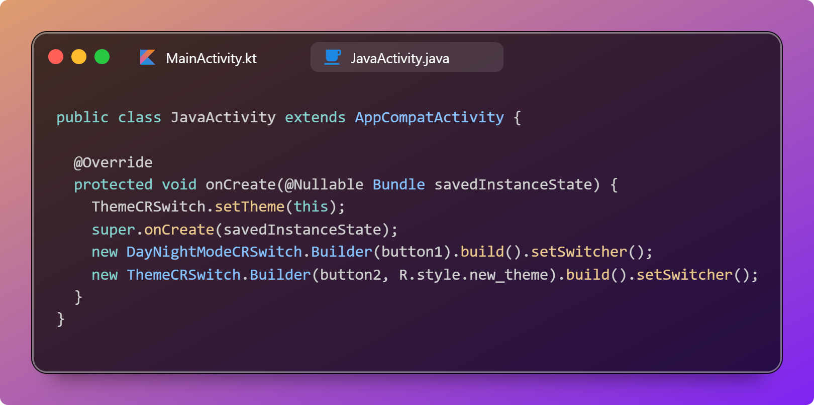
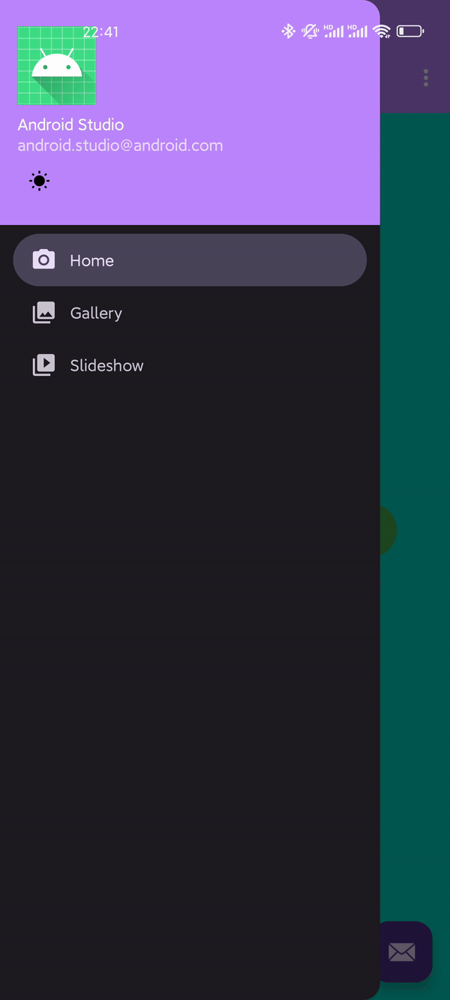
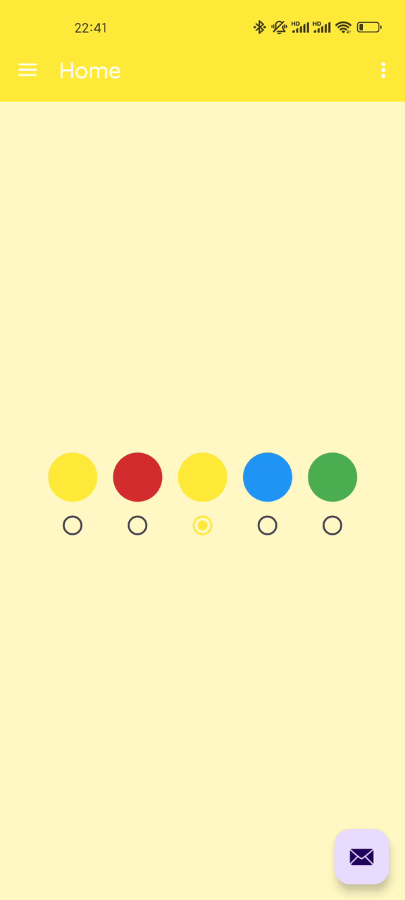

<p>
    <a href="./README.md">中文</a> | English
</p>

<h1 align="center">CircularRevealSwitch</h1>

<p align="center">
    <br>
    <strong>Just one line of code to achieve the Circular Reveal Theme Switch Animation in Telegram</strong>
    <br>
    <br>
    
    <br>
    <br>
    
</p>

<p align="center">
    
    
    
</p>

## Usage

Add JitPack repository to your settings.gradle.kts

```kotlin
dependencyResolutionManagement {
    repositoriesMode.set(RepositoriesMode.FAIL_ON_PROJECT_REPOS)
    repositories {
        google()
        mavenCentral()
        maven {
            url = uri("https://jitpack.io")
            // groovy:
            // url 'https://jitpack.io'
        }
    }
}
```

Add dependency in your module's build.gradle.kts

```kotlin
dependencies {
    implementation("com.github.YenalyLiew:CircularRevealSwitch:0.4.5")
}
```

## Usage Examples

| Day to Night Mode                                | Night to Day Mode                              | Switch to Yellow Theme                             | Switch to Red Theme                             |
| ------------------------------------------------ | ---------------------------------------------- | -------------------------------------------------- | ----------------------------------------------- |
|  |  |  |  |

## Requirements

Minimum Android API level required is 24 (Android 7.0).

CircularRevealSwitch depends on DecorView recycling, which is supported in Android 7.0 and above.

## Advantages

- [x] **No need to nest or add new Views manually**
- [x] Provides certain extensibility, with methods being `protected open`
- [x] Achieve the simplest Day/Night mode switch animation with just **one line of code**

## Basic Usage

### Day/Night Mode Switch

#### Kotlin

```kotlin
view.setDayNightModeSwitcher(
    duration = 400L,
    interpolator = FastOutSlowInInterpolator(),
    animToDayMode = SwitchAnimation.SHRINK,
    animToNightMode = SwitchAnimation.EXPAND,
    onNightModeAnimStart = { /* Callback for Night mode animation start */ },
    onNightModeAnimEnd = { /* Callback for Night mode animation end */ },
    onDayModeAnimStart = { /* Callback for Day mode animation start */ },
    onDayModeAnimEnd = { /* Callback for Day mode animation end */ },
    onClick = { /* Click event */ },
)
```

#### Java

```java
DayNightModeCRSwitch builder = new DayNightModeCRSwitch.Builder(view)
        .duration(400L)
        .interpolator(new FastOutSlowInInterpolator())
        .animToDayMode(SwitchAnimation.SHRINK)
        .animToNightMode(SwitchAnimation.EXPAND)
        .onNightModeAnimStart(() -> { /* Callback for Night mode animation start */ })
        .onNightModeAnimEnd(() -> { /* Callback for Night mode animation end */ })
        .onDayModeAnimStart(() -> { /* Callback for Day mode animation start */ })
        .onDayModeAnimEnd(() -> { /* Callback for Day mode animation end */ })
        .onClickListener((view) -> { /* Click event */ })
        .build();
builder.setSwitcher();
```

### Theme Switch

> ⚠ Call the `setTheme` method before `super.onCreate(savedInstanceState)` to load the theme you want to switch to. If you just want the animation, you can directly call `ThemeCRSwitch.setTheme(int)`.
>
> ⚠ `ThemeCRSwitch.setTheme(int)` is just a self-satisfying method and not recommended. If you need to save the theme state to apply it next time you start the app or open a new Activity, please store and set it yourself using SharedPreferences or other libraries.
>
> 🌰 Example:
>
> ```kotlin
> override fun onCreate(savedInstanceState: Bundle?) {
>  when (sharedPrefs().getString("theme", "default")) {
>      "red" -> setTheme(R.style.Theme_CircularRevealSwitch_Red)
>      "green" -> setTheme(R.style.Theme_CircularRevealSwitch_Green)
>      "blue" -> setTheme(R.style.Theme_CircularRevealSwitch_Blue)
>      "yellow" -> setTheme(R.style.Theme_CircularRevealSwitch_Yellow)
>      else -> setTheme(R.style.Theme_CircularRevealSwitch)
>  }
>  super.onCreate(savedInstanceState)
>  // view.setThemeSwitcher...
> }
> ```

#### Kotlin

```kotlin
view.setThemeSwitcher(
    toTheme = R.style.new_theme,
    duration = 400L,
    interpolator = FastOutSlowInInterpolator(),
    animToTheme = SwitchAnimation.EXPAND,
    onAnimStart = { /* Callback for theme switch animation start */ },
    onAnimEnd = { /* Callback for theme switch animation end */ },
    onClick = { /* Click event */ },
)
```

#### Java

```java
ThemeCRSwitch builder = new ThemeCRSwitch.Builder(view, R.style.new_theme)
        .duration(400L)
        .interpolator(new FastOutSlowInInterpolator())
        .animToTheme(SwitchAnimation.EXPAND)
        .onAnimStart(() -> { /* Callback for theme switch animation start */ })
        .onAnimEnd(() -> { /* Callback for theme switch animation end */ })
        .onClickListener((view) -> { /* Click event */ })
        .build();
builder.setSwitcher();
```

## ⚠ Notes

- This library heavily relies on `ActivityCompat#recreate` method. If your Activity changes its Views upon recreation, it might affect the user experience.
- **Avoid** performing actions related to the current Activity in `onAnimStart` and `onAnimEnd` callbacks because at that point, the old Activity is already destroyed, and any operations on components might be ineffective. However, you can execute some application-level tasks here. If you need to perform other tasks before the old Activity is destroyed, you can do so in `onClick`.
- ComponentActivity or higher is recommended.
- ~~API level 28 or higher is recommended due to reliance on `Handler#post` in `ActivityCompat#recreate`. In versions below API 28, the order of posting to the main message queue might differ, potentially causing animation issues, though it's rare.~~ (Resolved in `v0.3`)
- The `setSwitcher()` method overrides the original `onTouch()` and `onClick()` methods. If you need click events, you can call them from the constructor or inherit from the CircularRevealSwitch class and override the respective methods.
- This library only provides theme switching effects and does not handle theme persistence. If you need to save the theme for the next launch or opening of a new Activity, handle it yourself using SharedPreferences or other libraries.

## Updates

### v0.4.5

1. Fixed the issue where the day-night switch animation cannot play normally under multiple Activities

### v0.4

1. Implemented PixelCopy for screen capture on API level 26 and above, preserving effects like shadows.

   Removed `screenshot()` method, replaced with `takeScreenshotCompat()`.

2. Fixed the issue where `isViewClickable` logic wasn't effective.

### v0.3

1. Fixed #1: Some devices failing to start animations immediately due to delayed view attachment.
2. Fixed animations not displaying on devices with API level less than 28.